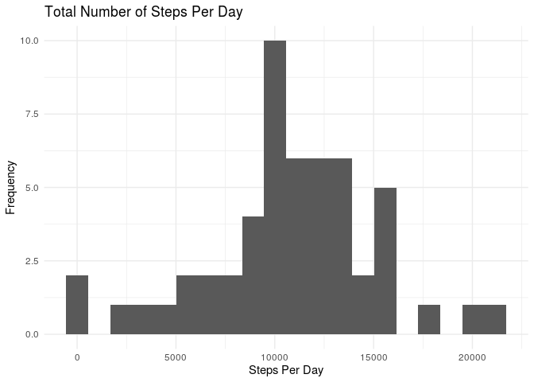
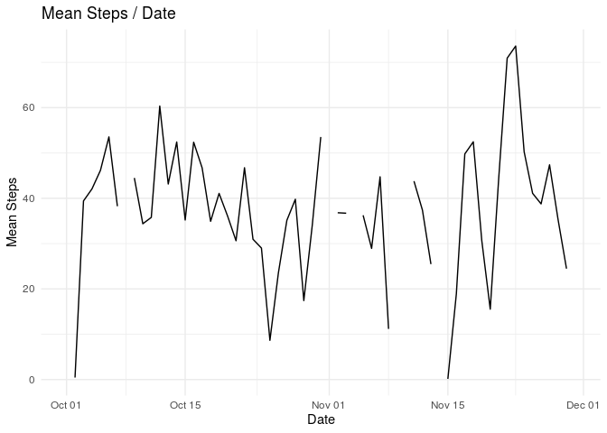
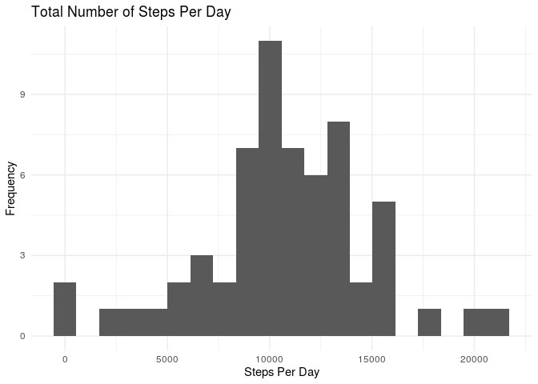
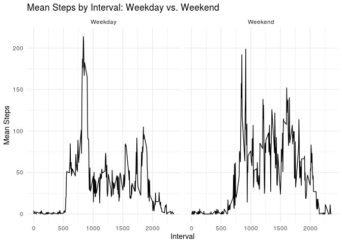
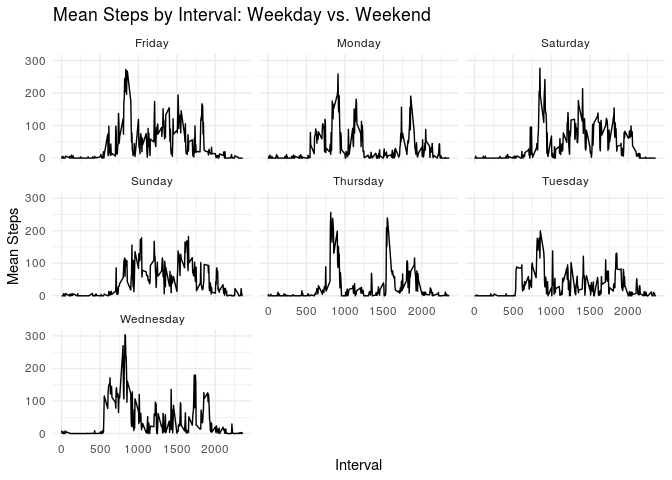

```r
library(tidyverse)
```

```
## ── Attaching packages ──────────────────────────────────────────────────────────────────────────────────────────────────────────────────────────────────────────────────── tidyverse 1.3.0 ──
```

```
## ✔ ggplot2 3.2.1     ✔ purrr   0.3.3
## ✔ tibble  2.1.3     ✔ dplyr   0.8.3
## ✔ tidyr   1.0.0     ✔ stringr 1.4.0
## ✔ readr   1.3.1     ✔ forcats 0.4.0
```

```
## ── Conflicts ─────────────────────────────────────────────────────────────────────────────────────────────────────────────────────────────────────────────────────── tidyverse_conflicts() ──
## ✖ dplyr::filter() masks stats::filter()
## ✖ dplyr::lag()    masks stats::lag()
```

```r
library(ggthemes)
library(mice)
```

```
## Loading required package: lattice
```

```
## 
## Attaching package: 'mice'
```

```
## The following object is masked from 'package:tidyr':
## 
##     complete
```

```
## The following objects are masked from 'package:base':
## 
##     cbind, rbind
```

## Loading and preprocessing the data

```r
data <- read.csv('activity.csv', sep=",")
data$date <- as.Date(data$date)
```


## What is mean total number of steps taken per day?

```r
data.steps <- data %>%
  group_by(date) %>%
  summarise(steps.p.day = sum(steps))
  
ggplot(data.steps, aes(x=steps.p.day)) +
  geom_histogram(bins=20) +
  ggtitle("Total Number of Steps Per Day") + 
  xlab("Steps Per Day") + 
  ylab("Frequency") +
  theme_minimal()
```

```
## Warning: Removed 8 rows containing non-finite values (stat_bin).
```

<!-- -->


```r
data %>%
  group_by(date) %>%
  summarise(mean.b.date = mean(steps, na.rm = TRUE)) %>%
  summarise(mean = mean(mean.b.date, na.rm = TRUE))
```

```
## # A tibble: 1 x 1
##    mean
##   <dbl>
## 1  37.4
```


```r
data %>%
  group_by(date) %>%
  summarise(median.b.date = median(steps, na.rm = TRUE)) %>%
  summarise(median = median(median.b.date, na.rm = TRUE))
```

```
## # A tibble: 1 x 1
##   median
##    <dbl>
## 1      0
```

## What is the average daily activity pattern?

```r
data.steps <- data %>%
  group_by(date) %>%
  summarise(mean = mean(steps, na.rm = TRUE))

ggplot(data.steps, aes(x=date, y=mean)) +
  geom_line() +
  ggtitle("Mean Steps / Date") + 
  xlab("Date") + 
  ylab("Mean Steps") +
  theme_minimal()
```

```
## Warning: Removed 2 rows containing missing values (geom_path).
```

<!-- -->


```r
data %>%
  group_by(interval) %>%
  summarise(mean = mean(steps, na.rm = TRUE)) %>%
  filter(mean == max(mean))
```

```
## # A tibble: 1 x 2
##   interval  mean
##      <int> <dbl>
## 1      835  206.
```


## Imputing missing values

```r
sum(is.na(data))
```

```
## [1] 2304
```


```r
imputes <- mice(data)
```

```
## 
##  iter imp variable
##   1   1  steps
##   1   2  steps
##   1   3  steps
##   1   4  steps
##   1   5  steps
##   2   1  steps
##   2   2  steps
##   2   3  steps
##   2   4  steps
##   2   5  steps
##   3   1  steps
##   3   2  steps
##   3   3  steps
##   3   4  steps
##   3   5  steps
##   4   1  steps
##   4   2  steps
##   4   3  steps
##   4   4  steps
##   4   5  steps
##   5   1  steps
##   5   2  steps
##   5   3  steps
##   5   4  steps
##   5   5  steps
```

```r
data.imp <- complete(imputes,5)
```


```r
data.steps <- data.imp %>%
  group_by(date) %>%
  summarise(steps.p.day = sum(steps))
  
ggplot(data.steps, aes(x=steps.p.day)) +
  geom_histogram(bins=20) +
  ggtitle("Total Number of Steps Per Day") + 
  xlab("Steps Per Day") + 
  ylab("Frequency") +
  theme_minimal()
```

<!-- -->


```r
data.steps <- data.imp %>%
  group_by(date) %>%
  summarise(mean = mean(steps, na.rm = TRUE))

ggplot(data.steps, aes(x=date, y=mean)) +
  geom_line() +
  ggtitle("Mean Steps / Date") + 
  xlab("Date") + 
  ylab("Mean Steps") +
  theme_minimal()
```

<!-- -->

## Are there differences in activity patterns between weekdays and weekends?

```r
activity <- data.imp %>% 
  mutate(weekday = weekdays(date)) %>%
    mutate(weekend = ifelse(weekday == "Saturday" | weekday == "Sunday", "Weekend", "Weekday"))
```


```r
activity %>% 
  group_by(weekend, interval) %>% 
  mutate(mean = mean(steps)) %>%
  ggplot(aes(x = interval, y = mean)) + geom_line() +
  facet_wrap(~weekend) +
  ggtitle("Mean Steps by Interval: Weekday vs. Weekend") + 
  xlab("Interval") + 
  ylab("Mean Steps") +
  theme_minimal()
```

<!-- -->

```r
activity %>% 
  group_by(weekday, interval) %>% 
  mutate(mean = mean(steps)) %>%
  ggplot(aes(x = interval, y = mean)) + geom_line() +
  facet_wrap(~weekday) +
  ggtitle("Mean Steps by Interval: Weekday vs. Weekend") + 
  xlab("Interval") + 
  ylab("Mean Steps") +
  theme_minimal()
```

<!-- -->


